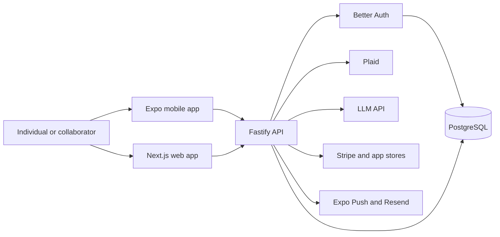
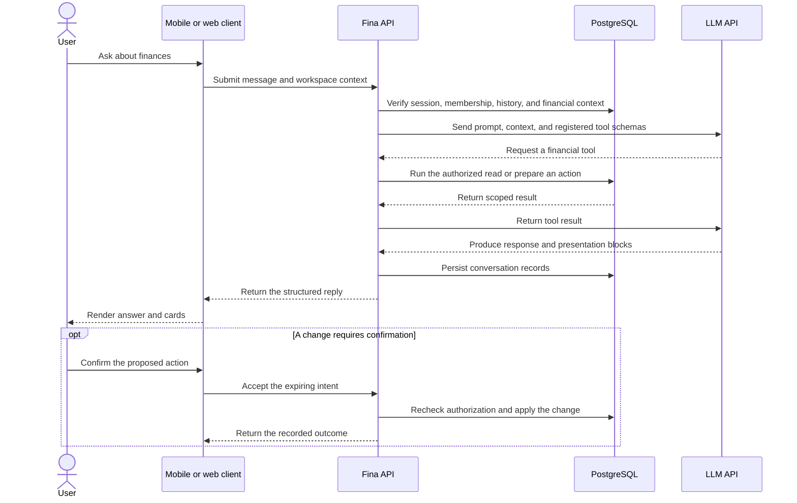

# Fina

### A chat-first financial workspace for understanding spending, planning ahead, and acting on financial data

**Status: Active development**

**Application type:** iOS, Android, and web application

> This repository contains public product and architecture documentation only. The production source code is maintained in a private repository.

## Product Overview

Fina brings bank activity, manually entered transactions, budgets, goals, recurring expenses, scheduled spending, and financial analysis into one workspace. It is designed for individuals and invited collaborators who want a clearer view of household finances without moving between a banking portal, spreadsheet, and separate planning tools.

The central workflow is conversational. A user can ask the advisor about their financial data, receive structured answers, and use confirmation cards for changes that need an explicit decision. The same underlying data is also available through conventional home, activity, analysis, and settings screens.

## Core Capabilities

### Financial activity

- **Bank connection and transaction synchronization:** Plaid Link connects supported institutions. The backend imports account and transaction updates, processes webhooks, and preserves sync progress.
- **Manual and imported records:** Users can add transactions manually, search and filter activity, edit details, split amounts across categories, and exclude records from budget calculations when appropriate.
- **Categorization workflow:** Rules, prior merchant mappings, provider metadata, and AI-assisted classification help categorize new activity. Ambiguous results can be surfaced for review.

### Planning and insight

- **Budgets and analysis:** Monthly plans, category allocations, cash-flow summaries, category breakdowns, and forecast-oriented analysis connect current activity to a forward-looking plan.
- **Goals and expected spending:** Goal tracking, recurring expenses, and scheduled spending model obligations that are not visible from completed transactions alone.
- **Morning briefs:** Scheduled processing can create a concise financial brief and notify an opted-in mobile device.

### Conversational advisor

- **Workspace-aware chat:** The advisor can answer questions using authorized workspace data and present purpose-built cards for transactions, budgets, goals, accounts, recurring items, and schedules.
- **Controlled actions:** Read operations and eligible writes use registered server-side tools. Actions that need reconsideration or are destructive can be presented as expiring confirmation intents before execution.
- **Conversation continuity:** Threads, messages, generated titles, unread state, and structured presentation blocks are persisted so conversations remain usable across sessions.

### Accounts, collaboration, and access

- **Authentication:** Email-based authentication and optional Google or Apple sign-in are implemented through Better Auth, with platform-specific session handling for web and mobile.
- **Shared workspaces:** Memberships, invitations, and owner/editor/viewer roles define access to shared financial data.
- **Subscription access:** Web billing and native mobile purchases feed a server-side entitlement model used to gate paid capabilities and support recovery flows.

## Engineering Scope

The repository represents end-to-end product engineering across:

- Product and data architecture for a multi-client financial application
- Expo/React Native mobile development and Next.js web development
- Fastify API design, service boundaries, and shared TypeScript contracts
- PostgreSQL data modeling and Prisma migrations
- Authentication, role-based workspace authorization, and administrative boundaries
- Plaid integration, encrypted bank-token storage, webhook processing, and transaction reconciliation
- Tool-driven AI orchestration, structured UI responses, usage accounting, and confirmation-gated actions
- Stripe, Apple App Store, and Google Play subscription reconciliation
- Scheduled jobs, email delivery, push notifications, container deployment, and release configuration
- API integration tests, client unit tests, and Playwright end-to-end coverage

This describes engineering areas visible in the private repository; it does not assign authorship to a particular individual.

## Technology Stack

| Area                  | Technologies                                           | How they are used                                                                                                                             |
| --------------------- | ------------------------------------------------------ | --------------------------------------------------------------------------------------------------------------------------------------------- |
| Mobile client         | Expo, React Native, Expo Router                        | Native iOS and Android navigation, financial workflows, secure session storage, notifications, and in-app purchases                           |
| Web client            | Next.js App Router, React                              | Authentication, workspace management, bank settings, billing, administration, legal pages, and product landing experience                     |
| Backend               | Node.js, Fastify, TypeScript, Zod                      | Authenticated APIs, validation, service orchestration, webhooks, rate limits, and security headers                                            |
| Shared contracts      | TypeScript workspace library, Zod                      | Request schemas, response DTOs, validation rules, error codes, constants, and a shared HTTP client factory                                    |
| Database              | PostgreSQL, Prisma                                     | Persistent financial, workspace, conversation, subscription, device, audit, and job state                                                     |
| Authentication        | Better Auth, Prisma adapter, Expo integration          | Email and social authentication, verification, sessions, and platform-specific client handling                                                |
| AI                    | LLM API                                                | Advisor responses, registered tool calls, structured presentation blocks, categorization assistance, briefs, titles, and planning suggestions |
| Banking               | Plaid                                                  | Institution linking, account and transaction synchronization, and webhook-driven updates                                                      |
| Billing               | Stripe, React Native IAP, Apple and Google server APIs | Web checkout and portal flows, native purchases, receipt verification, notifications, entitlement reconciliation, and recovery                |
| Notifications         | Expo Push Service, Resend                              | Mobile notifications, delivery-receipt handling, invitations, authentication mail, and support messages                                       |
| Background processing | Croner                                                 | Brief generation, refreshes, reconciliation, retries, cleanup, scheduled-spend matching, and trial notifications                              |
| Delivery and quality  | Nx, pnpm, Docker, EAS, Vitest, Jest, Playwright        | Monorepo orchestration, reproducible API images, mobile builds, unit/integration tests, and browser end-to-end checks                         |

## Architecture Overview

Web and mobile clients consume the same Fastify API and shared contracts. The API owns authentication checks, workspace authorization, financial services, AI tool execution, external-service credentials, webhook validation, and persistence. Scheduled work runs alongside the API runtime and uses the same service and data boundaries.



## Primary Product Flow

The representative end-to-end flow is an advisor conversation grounded in the user's authorized financial workspace.



## System Boundaries and Privacy

- **Data entering Fina:** Account identity, workspace membership, transaction and bank-account metadata, manually entered financial records, chat messages, plan data, device notification tokens, and subscription evidence.
- **Persistent storage:** Application records are stored in PostgreSQL. Web sessions use browser cookies; the mobile auth client uses secure device storage. Lightweight client preferences such as the active workspace are stored locally.
- **Banking boundary:** Institution linking occurs through Plaid. The API receives link and sync tokens plus account and transaction data; retained access tokens are encrypted before database storage.
- **AI boundary:** Advisor prompts, relevant financial context, tool inputs/results, and conversation content may be sent to the LLM API for remote processing. This is a sensitive data boundary and should be reflected in user-facing privacy disclosures.
- **Billing boundary:** Stripe receives web billing data. Apple and Google receive native purchase data and return signed purchase or subscription state for server verification.
- **Communication boundary:** Expo receives device push tokens and notification payloads. Resend receives recipient addresses and the content required for transactional email.
- **Local versus remote processing:** UI state, secure mobile session material, and limited preferences are handled on-device. Authorization, bank sync, financial calculations, AI orchestration, billing reconciliation, scheduled work, and durable storage occur remotely.

No certification or regulatory-compliance claim is made here. Financial records, authentication material, bank tokens, AI context, purchase evidence, support attachments, and notification payloads all require deliberate retention, logging, and disclosure controls.

## Engineering Challenges

### Reliable bank synchronization

**Constraint:** A transaction feed can arrive in pages, be replayed by webhooks, change after initial import, or overlap with a manual refresh.

**Difficulty:** Partial progress, duplicate delivery, and concurrent syncs can corrupt a ledger or lose a cursor.

**Approach:** The implementation uses cursor-based synchronization, item/workspace locking, transactional page application, idempotent upserts, retryable webhook records, and encrypted access-token storage.

### Safe AI actions over financial data

**Constraint:** A conversational model needs useful financial context without receiving unrestricted database access or silently performing risky changes.

**Difficulty:** Natural-language requests are ambiguous, model output is probabilistic, and mutations must remain authorized and auditable.

**Approach:** The API supplies a bounded registry of typed tools, executes tools server-side within user/workspace boundaries, persists structured presentation blocks, and uses expiring confirmation intents for selected changes.

### Consistent authorization across shared and personal state

**Constraint:** Financial records belong to role-governed workspaces while chat threads belong to a user and may later bind to a workspace.

**Difficulty:** Clients can switch workspaces, roles differ by operation, and cross-workspace leakage must be prevented at every service boundary.

**Approach:** Sessions, workspace membership, role checks, user ownership, and paid-tier gates are enforced by the API rather than trusted to client navigation.

### Subscription consistency across payment channels

**Constraint:** Web checkout and both mobile stores report state asynchronously and use different receipt, renewal, and recovery models.

**Difficulty:** Duplicate notifications, stale client state, account mismatches, and overlapping subscriptions can produce incorrect access.

**Approach:** Signed evidence is verified server-side, webhook events are deduplicated, native and web subscription records are normalized, and deterministic precedence selects the effective entitlement.

### Time-aware background communication

**Constraint:** Briefs, refreshes, schedule matching, trial notices, and push-receipt polling must run on different cadences and respect user time zones and preferences.

**Difficulty:** Retries can create duplicate messages, while process or provider failures can leave incomplete work.

**Approach:** A scheduler coordinates idempotency checks, durable brief/message records, retry jobs, receipt polling, cleanup tasks, and preference-aware delivery.

## Repository Status

The repository shows **active development** with recent release preparation, production-oriented API container configuration, mobile EAS build profiles, database migrations, and broad automated test coverage. Core financial, advisor, collaboration, billing, and notification paths are implemented.

This showcase does not claim that a particular build is currently available in an app store, that every deployment runbook step is live, or that production scale has been independently verified. Those operational facts are not fully verifiable from source history and configuration alone.

## Documentation

- [Technical architecture](docs/architecture.md)
- [Product flows](docs/product-flows.md)
- [Engineering decisions](docs/engineering-decisions.md)
- [Public release checklist](docs/public-release-checklist.md)
- [Screenshot preparation guide](assets/README.md)

## Product Screenshots

> Screenshots will be added after verifying that they contain no private user data, credentials, internal identifiers, or development-only information.

```md
<!-- assets/home-overview.png — Financial overview and next actions -->
<!-- assets/advisor-chat.png — Advisor response with structured financial cards -->
<!-- assets/activity-review.png — Searchable and categorized transaction activity -->
```
