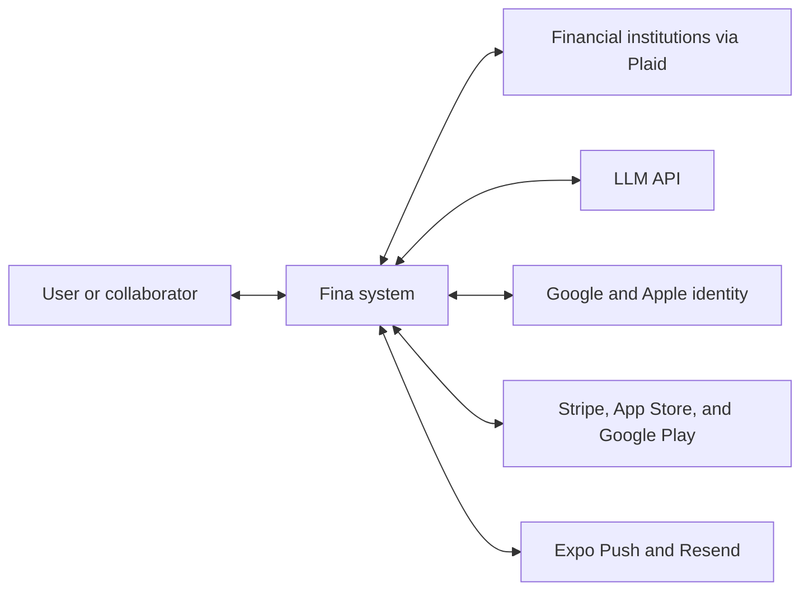
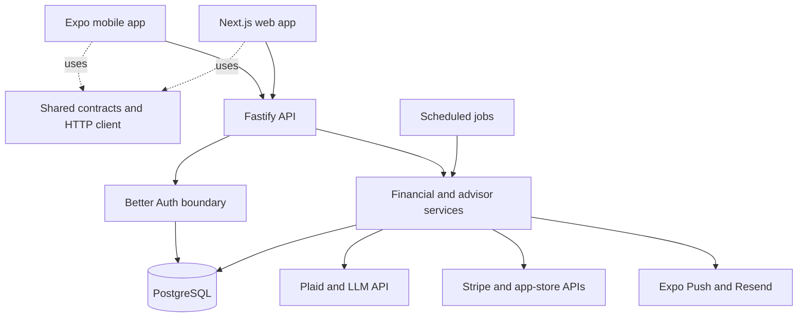
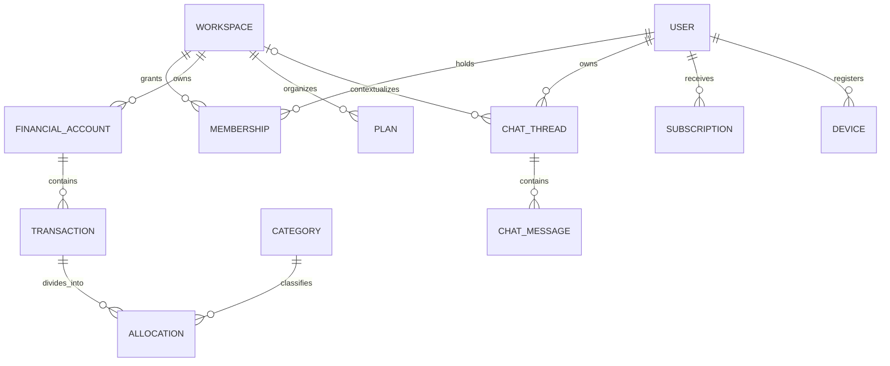
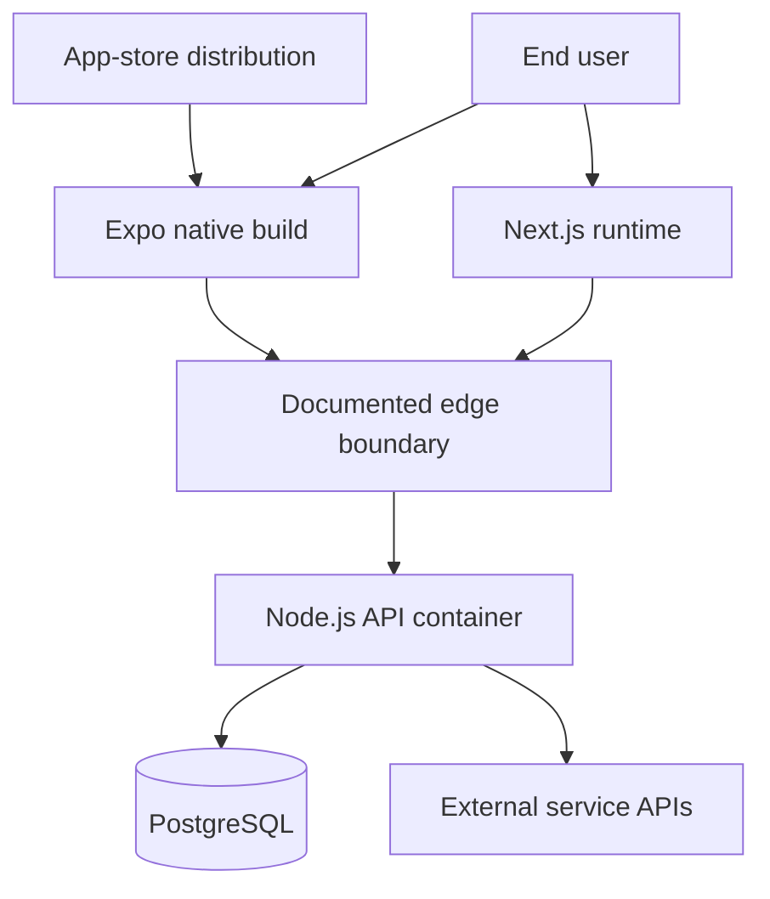

# Technical Architecture

## System Context

Fina is a multi-client personal-finance system for individuals and invited workspace collaborators. The mobile and web applications provide financial workflows; a central API owns identity checks, authorization, business rules, external integrations, and durable data.

External systems supply bank data, AI inference, identity federation, billing state, email delivery, and push delivery. These dependencies are reached through the API except for provider-controlled client experiences such as bank linking, social sign-in, and native purchase presentation.

## Container-Level Architecture

The repository is an Nx and pnpm monorepo with three runtime applications and one shared library:

- The **Expo mobile application** serves iOS and Android and contains the deepest product workflow coverage.
- The **Next.js web application** provides account, workspace, bank, billing, administration, legal, and marketing experiences.
- The **Fastify API** exposes authenticated financial services and webhook entry points.
- The **shared TypeScript library** supplies contracts and transport behavior to all applications.
- **PostgreSQL** stores identity, workspace, financial, conversation, billing, device, and operational records.
- A **Croner scheduler** runs in the API process when enabled and calls the same services used by HTTP flows.

The scheduler is a runtime module in the API process, not a separately proven worker deployment. This distinction matters when reasoning about availability and scaling.

## Major Modules

| Module                                | Responsibility                                                                                                                                 | Main dependencies                                                   |
| ------------------------------------- | ---------------------------------------------------------------------------------------------------------------------------------------------- | ------------------------------------------------------------------- |
| Mobile application                    | Primary product UI, navigation, secure auth storage, workspace selection, bank linking, advisor cards, push registration, and native purchases | Expo, React Native, Expo Router, Better Auth client, shared library |
| Web application                       | Authentication, workspaces and invitations, bank and plan settings, admin UI, legal pages, and landing experience                              | Next.js, React, Better Auth client, shared library                  |
| Shared library                        | DTOs, request schemas, validation, errors, roles, tier rules, formatting, and API client construction                                          | TypeScript, Zod                                                     |
| API and auth boundary                 | HTTP lifecycle, validation, sessions, role checks, tier gates, rate limits, security headers, and route orchestration                          | Fastify, Better Auth, Zod                                           |
| Financial data services               | Bank connections, cursor sync, accounts, transactions, splits, categorization, and merchant mappings                                           | Plaid, Prisma, PostgreSQL, encryption helper                        |
| Planning and analysis                 | Budgets, recurring expenses, scheduled spending, goals, cash flow, category analysis, and forecasts                                            | Prisma, shared validation, financial services                       |
| Advisor services                      | Context assembly, model calls, registered tools, structured blocks, conversation persistence, and confirmation intents                         | LLM API, Prisma, financial and planning services                    |
| Billing services                      | Web checkout, native purchase verification, subscription normalization, effective-tier selection, and recovery                                 | Stripe, Apple server APIs, Google Play APIs, Prisma                 |
| Background and communication services | Briefs, refreshes, retries, cleanup, schedule matching, trial notices, email, and push receipts                                                | Croner, Expo Push Service, Resend, Prisma                           |

## Data Architecture

The schema separates identity from shared financial workspaces. A user can hold memberships in multiple workspaces, while each workspace owns its accounts, transactions, categories, and planning records. Transaction allocations connect ledger entries to categories. Chat threads are user-owned and may optionally bind to a workspace; their messages can store both text and structured presentation blocks. Subscription and device records remain user-scoped.

The public model below deliberately generalizes individual planning tables and excludes internal identifiers, provider tokens, audit payloads, indexes, and operational fields.

`PLAN` represents implemented budget plans, goals, recurring expenses, and scheduled spending. Operational tables also support webhook deduplication, action intents, briefs, push receipts, audits, purchase-integrity guards, and AI usage records.

## Authentication and Authorization

Authentication is hosted inside the Fastify API through Better Auth and its Prisma adapter. The implementation supports email/password with email verification, email one-time-password and magic-link capabilities, plus optional Google and Apple providers. The web client uses credential-bearing browser sessions. The Expo client uses Better Auth's mobile integration and secure device storage for session material.

Authorization is layered:

1. Protected API operations require a valid session.
2. Workspace operations resolve membership from server-side state.
3. Owner, editor, and viewer roles set operation-specific minimum permissions.
4. Chat threads are checked against their owning user; workspace-backed messages also require membership in the selected workspace.
5. Paid features use an effective tier calculated by the API from trials and normalized subscription records.
6. Administrative APIs use a distinct database-backed global role check.

Clients carry navigation and active-workspace state, but they are not the authority for access control. Sensitive integration credentials and receipt verification remain server-side.

## External Integrations

| Integration               | Purpose                                                           | Data exchanged                                                                                                               |
| ------------------------- | ----------------------------------------------------------------- | ---------------------------------------------------------------------------------------------------------------------------- |
| Plaid                     | Institution linking and incremental financial-data sync           | Link/public tokens, encrypted server-held access tokens, account and transaction records, sync cursors, and webhook metadata |
| LLM API                   | Advisor inference and selected AI-assisted workflows              | User prompts, relevant financial context, tool schemas, tool inputs/results, generated responses, and usage metadata         |
| Stripe                    | Web subscription checkout, customer portal, and lifecycle updates | Customer reference, selected plan, checkout state, and signed subscription events                                            |
| Apple App Store           | Native iOS purchases and subscription lifecycle                   | Signed transaction evidence, product and status data, account binding, and server notifications                              |
| Google Play               | Native Android purchases and subscription lifecycle               | Purchase evidence, product and status data, acknowledgement state, account binding, and server notifications                 |
| Google and Apple identity | Optional social authentication                                    | Provider identity assertions and the profile fields required to establish a Fina account/session                             |
| Expo Push Service         | Mobile notification delivery and receipt polling                  | Device push token, notification content, delivery ticket, and receipt status                                                 |
| Resend                    | Transactional and support email                                   | Recipient address, subject, and message or attachment content needed for the selected workflow                               |

The table describes repository-confirmed integration behavior, not provider certification or a complete privacy policy.

## Deployment Model

The API has a production multi-stage Docker image. It builds the Prisma client and Nx API artifact, installs production dependencies into a slim Node.js runtime, runs as a non-root user, applies database migrations at startup, handles termination signals, and exposes a database-aware health check. PostgreSQL 16 is used for local development and is the documented production datastore family.

The mobile project contains EAS development, preview, production, and submission profiles, with native configuration for notifications, authentication, and in-app purchases. The web application uses the Next.js production build model and can be deployed separately from the API.

The private repository includes a runbook for a Cloudflare-fronted Coolify deployment and a containerized API, but source code cannot prove that a specific host, edge configuration, backup, monitor, or web deployment option is currently live. The diagram therefore labels those elements as documented deployment boundaries rather than verified runtime inventory.

## Repository Evidence

The architecture above is supported by the private repository's `apps/mobile/app`, `apps/mobile/src`, `apps/web/src/app`, `apps/api/src/server.ts`, `apps/api/src/main.ts`, `apps/api/src/auth.ts`, `apps/api/src/cron`, `apps/api/src/plaid`, `apps/api/src/chat`, `apps/api/src/iap`, `apps/api/prisma/schema.prisma`, `libs/shared/src`, `apps/api/Dockerfile.prod`, `eas.json`, and application test directories. These paths are cited as evidence only; production source is not included in this public showcase.
