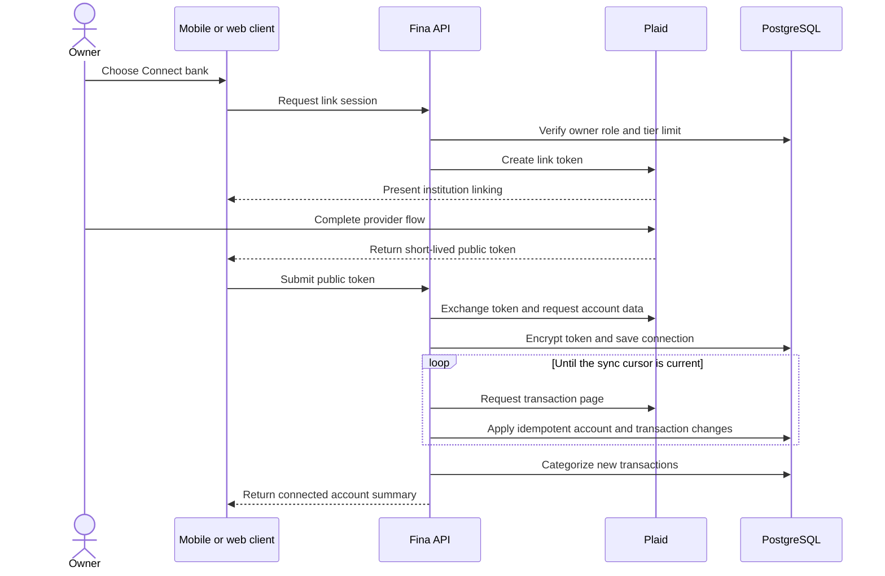
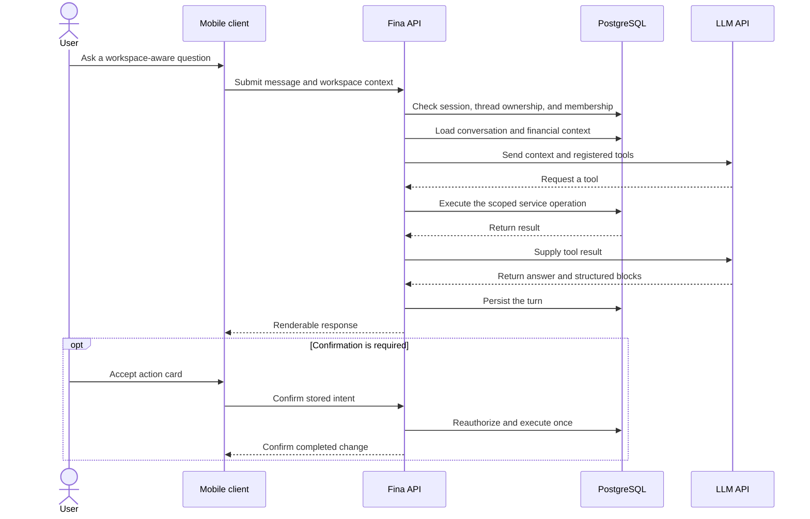
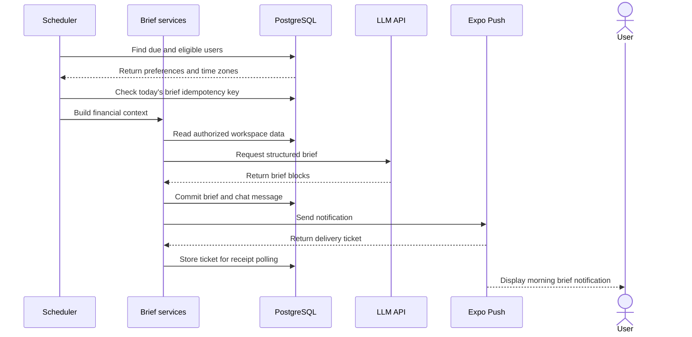
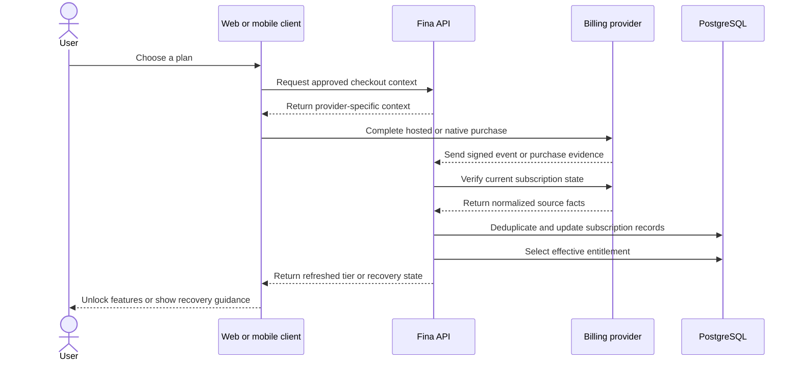

# Product Flows

## Flow 1: Connect a Bank and Import Activity

### Goal

Bring institution accounts and transaction history into an authorized financial workspace, then keep that data current.

### Actors

- Workspace owner
- Mobile or web client
- Fina API
- Plaid
- PostgreSQL

### Preconditions

- The user has an authenticated session.
- The user is an owner of the selected workspace.
- The effective subscription tier permits another bank connection.

### Main Steps

1. The client asks the API to create a Plaid Link session.
2. The user completes institution linking in Plaid's client experience.
3. The client sends the resulting short-lived public token to the API.
4. The API rechecks workspace authorization and exchanges the token server-side.
5. The long-lived bank token is encrypted before persistence.
6. The API synchronizes accounts and transaction pages using a durable cursor and guarded updates.
7. Newly imported transactions enter the categorization pipeline.
8. Later Plaid webhooks trigger incremental sync and item-status handling.

### Failure or Alternate Paths

- A tier limit prevents creating an additional connection.
- Link or exchange errors return a recoverable client error without persisting a usable connection.
- Concurrent synchronization is skipped or retried through locking and durable webhook state.
- A provider request for relinking changes connection status and allows the UI to direct the user back through Plaid.
- Users can keep historical transactions when removing a connection, or explicitly choose the destructive alternative.

### Relevant Components

Mobile/web bank settings, Fastify bank routes, Plaid client, token encryption, cursor sync, workspace locks, webhook dispatcher, categorization service, PostgreSQL.

## Flow 2: Ask the Advisor and Approve a Financial Action

### Goal

Use natural language to understand workspace finances and, when appropriate, apply a controlled change.

### Actors

- Authenticated user
- Mobile client
- Fina API
- LLM API
- PostgreSQL

### Preconditions

- The user has access to a paid advisor tier.
- The chosen workspace exists and the user is a member.
- The request can be served by one or more registered advisor tools.

### Main Steps

1. The user starts a new or existing chat and selects workspace context.
2. The API verifies thread ownership and workspace membership, then binds a new thread when needed.
3. The API assembles bounded conversation history and relevant financial context.
4. The LLM API receives the prompt plus registered tool declarations.
5. The model requests a tool; the API validates and dispatches it against server-side services.
6. Tool results return to the model for a user-facing response and structured presentation blocks.
7. Messages, tool records, blocks, unread state, and usage accounting are persisted.
8. If a proposed change needs explicit confirmation, the user receives an expiring action card and accepts it in a second request.
9. The API rechecks ownership and authorization before executing the stored action and recording the outcome.

### Failure or Alternate Paths

- Missing membership, workspace mismatch, or insufficient tier stops the turn before financial data is disclosed.
- Model or tool failures produce a controlled API failure; no client-provided tool result is trusted.
- The model can answer directly when no tool is needed.
- Clearly specified, low-risk writes may execute directly; selected destructive or reconsiderable actions use confirmation.
- Expired, previously used, or foreign intents cannot be executed.

### Relevant Components

Mobile thread view, chat routes, context builder, model provider, tool registry and dispatcher, action-intent service, financial services, message and usage records.

## Flow 3: Generate and Deliver a Morning Brief

### Goal

Proactively summarize useful financial context at the user's configured local time and make the brief available in chat.

### Actors

- Scheduler
- Fina API services
- LLM API
- PostgreSQL
- Expo Push Service
- Mobile user

### Preconditions

- Scheduled processing is enabled.
- The user is eligible, has opted into a supported brief frequency, and has relevant financial data.
- The user's time zone and notification preferences are available.

### Main Steps

1. The scheduler selects users whose local delivery window is due.
2. The job performs a bulk idempotency check to avoid duplicate briefs for the same date.
3. The API builds a workspace-aware snapshot of balances, plans, scheduled items, goals, and forecast signals.
4. The LLM API produces structured brief blocks.
5. The brief and its assistant chat message are committed together.
6. If a push-eligible device exists, the API sends a compact notification through Expo.
7. Delivery tickets are stored and a later job polls receipts.
8. Tapping the notification routes the user to the relevant brief or conversation.

### Failure or Alternate Paths

- Frequency, tier, missing data, or time-window checks can skip generation.
- A duplicate date is ignored instead of emitting another message.
- Model failure leaves no partially committed brief.
- Notification failure does not remove the persisted in-app brief.
- Invalid device tokens can be retired after receipt processing.

### Relevant Components

Croner scheduler, daily-brief job, financial context builder, LLM API integration, brief/chat tables, Expo push sender, push-ticket and receipt jobs, mobile push routing.

## Flow 4: Establish and Recover Subscription Access

### Goal

Translate web or native purchase evidence into one server-authoritative access tier and guide the user through mismatches or recovery.

### Actors

- User
- Web or mobile client
- Fina API
- Stripe, Apple App Store, or Google Play
- PostgreSQL

### Preconditions

- The user has an authenticated account.
- A supported product is available through the current platform's billing channel.

### Main Steps

1. The client starts a web checkout or native store purchase using server-approved product data.
2. The payment provider completes the hosted or native purchase experience.
3. Webhooks, store notifications, or an app-initiated sync deliver purchase evidence to the API.
4. The API verifies provider evidence and checks account binding.
5. Provider-specific status is normalized into a subscription record.
6. The API applies deterministic precedence across active records and calculates the effective tier.
7. Clients refresh the current-user response and unlock eligible features from that server result.
8. Restore, refresh, and recovery paths resolve stale local state or explain an account mismatch without trusting the device alone.

### Failure or Alternate Paths

- Invalid, expired, mismatched, or wrong-environment evidence is rejected or routed to recovery.
- Duplicate webhooks are deduplicated.
- Unknown native notifications use bounded retry and integrity records rather than granting access.
- Cancellation or billing-retry events update normalized state asynchronously.
- A successful store purchase can still require recovery if it is bound to another Fina account.

### Relevant Components

Web plan page, native IAP client and store, billing routes, Stripe webhook service, Apple and Google verification clients, subscription sync, entitlement precedence, recovery UI, PostgreSQL.

## Repository Evidence

These flows are supported by the private repository's bank connection and sync modules, chat route and tool registry, intent service, scheduler and brief jobs, push sender and receipt polling, billing and IAP modules, mobile screens, Prisma schema, and their integration tests. File paths are summarized in [Engineering Decisions](engineering-decisions.md) without reproducing production source.
