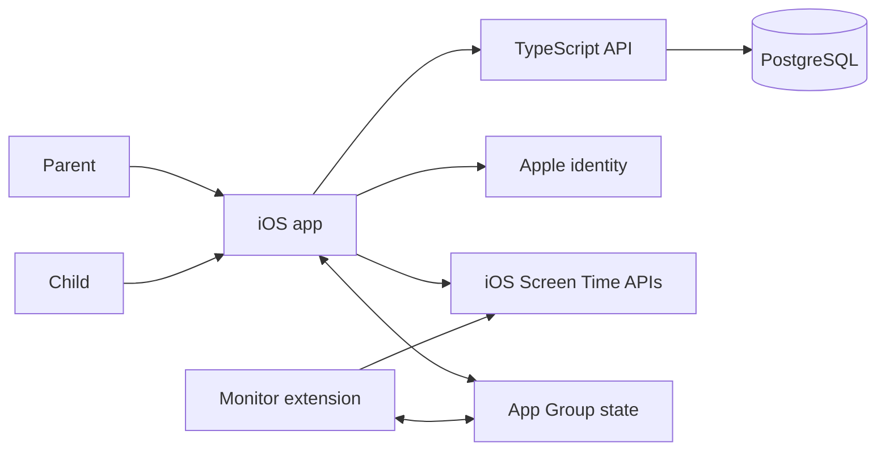
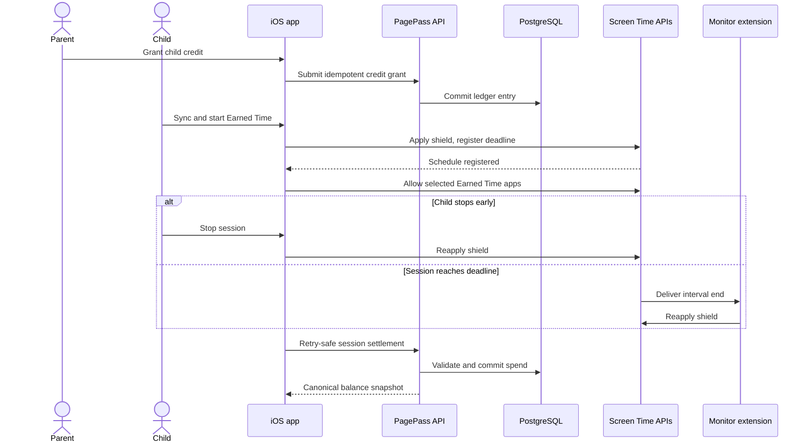

# PagePass

**Read pages. Earn screen time.**

**Status:** `MVP · Active development`

**Application:** Native iOS app for parent and child roles (iOS 17.4+)

> This repository contains public product and architecture documentation only. The production source code is maintained in a private repository.

## Product Overview

PagePass is a reading-first parental-control product for families. Its intended product loop turns offline reading and a parent-reviewed handwritten book report into time-limited access to selected iOS apps. This replaces repeated screen-time negotiation with a visible earn-and-spend model: a parent controls credit, while a child deliberately starts and stops an Earned Time session.

The current MVP implements the technical foundation of that loop: family setup, child-device pairing, parent-controlled credit, server synchronization, and a fail-closed iOS Screen Time session. Book-report capture, OCR, review, and approval are planned product work and are not represented as complete features here.

## Core Capabilities

### Family setup and access

- **Parent and child installation roles:** one native app presents role-specific workflows.
- **Parent authentication:** Sign in with Apple is connected to server-issued parent sessions, with credentials stored in the iOS Keychain. A local-token mode remains available for controlled development and migration.
- **Child profiles:** an authenticated parent can create and view child profiles and their canonical balances.

### Secure device connection

- **QR or numeric pairing:** the parent creates a short-lived, single-use pairing session that the child device consumes by scanning a QR code or entering a six-digit fallback code.
- **One active device boundary:** server rules prevent an installation from silently moving between children and prevent a second installation from replacing an already connected child device.
- **Device credentials:** a successful pairing issues a child-scoped credential that is stored in the Keychain and used to fetch the child's snapshot and submit settlements.

### Earned Time control loop

- **Local app policy:** the child device uses Apple's Family Controls picker to choose Earned Time and Always Allowed apps.
- **Explicit sessions:** a child with at least 15 minutes of credit can start a wall-clock session. The current UI uses the available balance as the requested duration.
- **Fail-closed enforcement:** Managed Settings keeps restricted apps shielded outside an active session. Registration failures and state-recovery failures return to a restrictive policy.
- **Manual stop and background expiry:** stopping early charges rounded-up elapsed time; expiry charges the selected duration. A Device Activity monitor extension re-applies restrictions even when the host app is not running.
- **Durable synchronization:** pending settlements survive locally and retry against a PostgreSQL-backed, idempotent server ledger.

## Engineering Scope

The repository represents full-stack product architecture across:

- native SwiftUI interface and state management for parent and child experiences;
- iOS Screen Time integration using Family Controls, Managed Settings, Device Activity, and an app extension;
- secure authentication, Keychain credential lifecycle, and device-pairing boundaries;
- a TypeScript HTTP API with shared runtime-validated contracts;
- PostgreSQL data modeling, append-only migrations, transactional ledger updates, and concurrency controls;
- local/server state reconciliation, idempotent retries, and fail-closed recovery;
- unit, API, database integration, adversarial, simulator, and documented physical-device verification.

The repository does not establish individual authorship. This scope describes the engineering work represented by the implementation.

## Technology Stack

| Area | Technologies | How they are used |
| ---- | ------------ | ----------------- |
| iOS client | Swift 6, SwiftUI, Observation | Builds role-specific parent and child interfaces and observable feature stores. |
| iOS platform | Family Controls, Managed Settings, Device Activity | Selects applications, applies shields, schedules absolute session deadlines, and handles expiry in an extension. |
| Local persistence | App Group storage, `UserDefaults`, file locking | Shares session and policy state between the app and monitor extension and serializes cross-process mutations. |
| Authentication | Sign in with Apple, Authentication Services, JOSE, iOS Keychain | Authenticates parents, verifies identity assertions, issues server sessions, and stores parent and child credentials locally. |
| Networking | `URLSession`, Node.js HTTP | Exchanges JSON between the iOS app and a thin server boundary; the release client requires its configured HTTPS origin. |
| API contracts | TypeScript, Zod | Defines and validates parent, pairing, snapshot, credit, and settlement payloads at runtime. |
| Database | PostgreSQL, Prisma schema and migrations, postgres.js | Persists identities, child ownership, pairing state, device bindings, credit grants, and Earned Time spends with transactional queries. |
| Workspace | Nx, pnpm, XcodeGen, Swift Package Manager | Coordinates TypeScript and iOS generation, build, test, and schema tasks in one monorepo. |
| Testing | Node test runner, Swift Testing, PostgreSQL integration tests | Covers contracts, authorization boundaries, idempotency, concurrent settlement, state transitions, and Screen Time support logic. |

## Architecture Overview

The native iOS app contains both parent and child experiences. Parent operations and child balance synchronization cross the HTTP API boundary. Screen Time policy and active-session enforcement stay on the child device, where the host app and monitor extension coordinate through App Group state. PostgreSQL is the canonical source for identity, ownership, pairing, and credit-ledger data.

## Primary Product Flow

The most complete end-to-end workflow in the current MVP is granting, using, and settling Earned Time.

## System Boundaries and Privacy

- **Data entering the system:** parent identity attributes, child profile names, device metadata, pairing proofs, credit reasons, and Earned Time settlement timestamps and durations can cross the API boundary.
- **External identity service:** Sign in with Apple supplies a parent identity assertion. The API validates it against Apple's public signing keys before creating an application session.
- **Persistent server data:** PostgreSQL stores generalized account, ownership, session, pairing, device-binding, and credit-ledger records. Secrets and credentials are stored as digests rather than reusable plaintext values.
- **On-device data:** opaque app-selection tokens and Screen Time policy remain in the shared app container. Parent and child session credentials remain in the iOS Keychain. The host app and monitor extension also persist local session and pending-settlement state.
- **Local processing:** QR scanning, application selection, shield changes, deadline scheduling, elapsed-time calculation, and extension recovery occur on the device through Apple frameworks.
- **Sensitive areas:** identity information, child names, device names, pairing material, credentials, app selections, and future report images require strict access control and careful logging. The repository makes no compliance certification claim.

The implemented system does not yet upload book-report photos or OCR text and contains no AI-provider integration.

## Engineering Challenges

### 1. Enforcing a session after the app leaves the foreground

- **Constraint:** iOS controls application shielding and background callback delivery; the host app cannot behave like a continuously running timer.
- **Difficulty:** the selected apps must be restricted again even if the app is backgrounded or terminated, and the tested Device Activity schedule has a 15-minute minimum.
- **Approach:** PagePass registers a nonrepeating absolute schedule, verifies registration before unlocking, and uses a monitor extension plus host-app deadline reconciliation to reapply restrictions.

### 2. Failing closed across multiple state transitions

- **Constraint:** a crash or platform error between persistence, scheduling, and shielding could otherwise leave apps available without a valid session.
- **Difficulty:** operation order matters across the host process, system frameworks, and extension.
- **Approach:** the restrictive policy is applied first, the session is persisted in explicit phases, the schedule is verified, and only then are Earned Time apps allowed. Error paths use an emergency restrictive policy.

### 3. Coordinating the app and monitor extension

- **Constraint:** both processes can observe or end the same session.
- **Difficulty:** simultaneous host recovery and expiry callbacks must not charge twice or corrupt local state.
- **Approach:** a shared reducer defines legal transitions, App Group state persists the session, and a file lock serializes mutations across processes. Duplicate end actions are idempotent.

### 4. Reconciling local behavior with a canonical ledger

- **Constraint:** the child device must restrict apps immediately, including during network outages, while the server remains authoritative for balance.
- **Difficulty:** retries, delayed synchronization, concurrent spends, and server replacement can produce stale or duplicate state.
- **Approach:** the app queues settlements locally; requests carry stable idempotency keys; the server recalculates accepted consumption inside database transactions; snapshots include a ledger revision and server identity for guarded replacement.

### 5. Pairing a child device without broad account credentials

- **Constraint:** a child device needs scoped access without receiving a parent's session.
- **Difficulty:** fallback codes are easier to guess, pairing must not be replayed, and device ownership must remain unambiguous.
- **Approach:** the API creates short-lived single-use QR and numeric proofs, rate-limits numeric attempts, stores proof digests, enforces one active installation per child, and issues a separate child-device credential.

## Repository Status

**Implemented MVP foundation**

- Native iOS parent and child role interfaces
- Sign in with Apple server session flow and controlled local-auth migration path
- Child profiles, QR/numeric pairing, and one-device ownership rules
- Parent credit grants and child balance snapshots
- Local Screen Time policy, explicit maximum-duration session, manual stop, expiry, recovery, and server settlement
- PostgreSQL persistence and automated tests for critical state and authorization boundaries

**Verified on physical hardware**

- The repository includes a recorded iPhone test demonstrating a 15-minute wall-clock session, early-stop settlement, and automatic expiry re-lock while the host app was terminated.

**Planned or not yet verifiable as implemented**

- Reading timer and submission workflow
- Handwritten report capture and image storage
- OCR generation and parent review
- Approval, rejection, and rewrite decisions tied to credit
- AI-assisted review
- Push notifications
- Production hosting topology and public release readiness

## Documentation

- [Technical architecture](docs/architecture.md)
- [Product flows](docs/product-flows.md)
- [Engineering decisions](docs/engineering-decisions.md)
- [Public release checklist](docs/public-release-checklist.md)

## Product Screenshots

> Screenshots will be added after verifying that they contain no private user data, credentials, internal identifiers, or development-only information.

Suggested captures and guidance are available in [assets/README.md](assets/README.md).

<!-- assets/role-selection.png — Choose the parent or child experience -->
<!-- assets/parent-family-dashboard.png — View child profiles, balances, and connection state -->
<!-- assets/child-earned-time.png — Review balance and start an Earned Time session -->
<!-- assets/earned-time-active.png — Track an active wall-clock session -->
