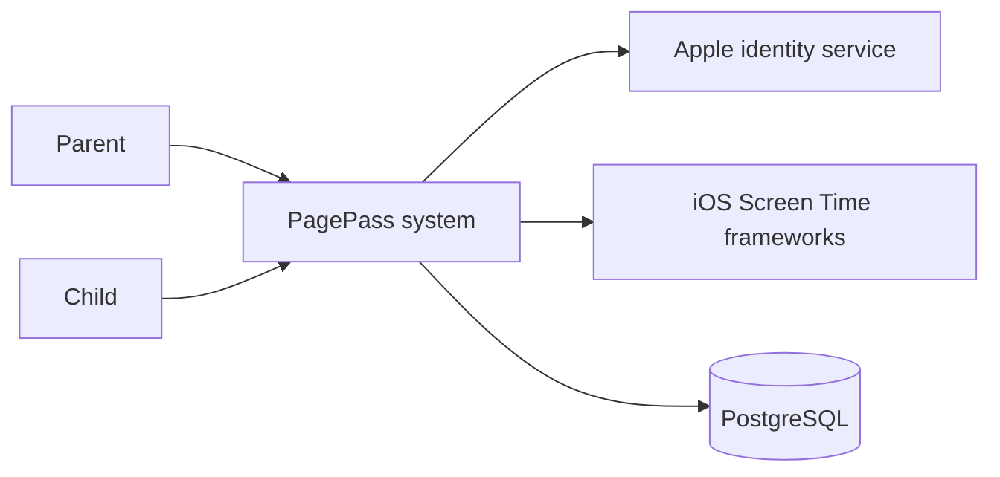
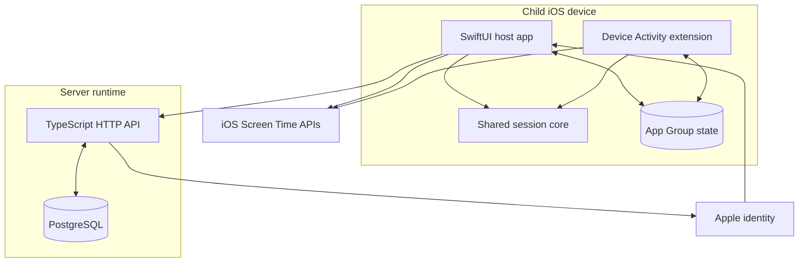
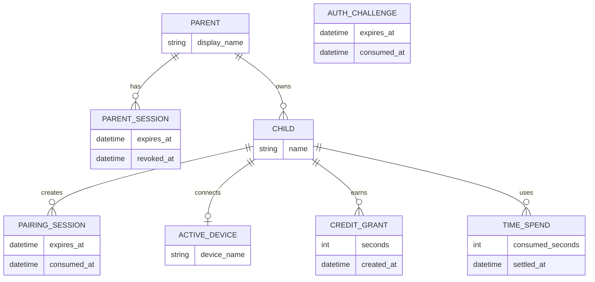
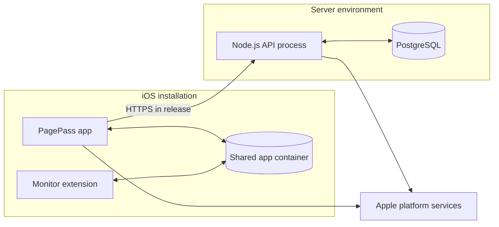

# PagePass Technical Architecture

## System Context

PagePass is a native iOS application for two users: a parent who manages child profiles and grants credit, and a child who connects a device and deliberately uses Earned Time. A server maintains account ownership, device pairing, and the canonical credit ledger. Apple's identity and Screen Time capabilities provide authentication and on-device enforcement.

The implemented architecture deliberately keeps application-selection policy and shield control on the child device. The server receives balance and session information, but it does not receive the opaque Family Controls selection in the current implementation.

## Container-Level Architecture

The iOS host app and Device Activity monitor extension are separate runtime processes. They share a small Swift package for session state transitions and an App Group container for durable policy and session state. The API is a standalone Node.js process backed by PostgreSQL; it validates all JSON boundaries and performs transactional ledger operations.

The same host-app binary also presents the parent experience. Parent features use the API but do not participate in the child device's App Group session loop.

## Major Modules

| Module | Responsibility | Main dependencies |
| ------ | -------------- | ----------------- |
| App root and role surfaces | Selects parent or child installation behavior and composes role-specific navigation. | SwiftUI, app preferences |
| Parent authentication | Runs Sign in with Apple, restores or revokes application sessions, and guards the parent experience. | Authentication Services, API client, Keychain |
| Parent family management | Lists and creates child profiles, grants credit, creates pairing sessions, and supports controlled migration from local authentication. | SwiftUI, Observation, API client |
| Child pairing and sync | Scans or accepts a pairing proof, stores the child credential, fetches snapshots, and retries pending settlements. | VisionKit, URLSession, Keychain |
| Earned Time orchestration | Requests Screen Time authorization, stores app policy, starts and stops sessions, and reconciles deadlines and server revisions. | Family Controls, Managed Settings, Device Activity, shared session core |
| Shared session core | Defines session phases, legal state transitions, elapsed-time charging, pending settlements, and retry identity. | Swift standard library, Foundation |
| Monitor extension | Handles scheduled expiry when the host app is not running and re-applies the restrictive policy. | Device Activity, Managed Settings, App Group state |
| API boundary and contracts | Routes parent and child operations, validates request and response shapes, limits request size, and maps safe JSON errors. | Node.js HTTP, TypeScript, Zod, shared contracts |
| PostgreSQL store | Enforces parent ownership, pairing rules, session authentication, canonical balances, idempotency, and concurrent settlement. | postgres.js, PostgreSQL, Prisma-managed schema and migrations |

## Data Architecture

The server data model separates parent identity and session records from child ownership and child-device credentials. Credit is represented as immutable grant and spend records rather than a directly mutable balance field; current balance is derived transactionally from those records. The diagram omits internal identifiers, cryptographic digests, rate-limit records, and operational state.

### Local data model

The child device maintains a separate operational model:

- an opaque Family Controls policy containing Earned Time and Always Allowed selections;
- the current balance snapshot and server/child ledger binding;
- at most one current session, moving through arming, active, ending, pending, and settled/rejected phases;
- pending settlements that remain available for retry after an outage;
- parent and child credentials in distinct Keychain records.

This local state enables immediate enforcement while preserving the server as the canonical balance authority.

## Authentication and Authorization

### Parent authentication

The release-facing flow uses Sign in with Apple. The client requests a server-generated challenge, asks Apple for a credential bound to that challenge, and sends the identity assertion to the API. The server verifies the assertion's signature and required claims using Apple's public keys, creates or reuses a parent account, and issues an application session. The client stores that session and its Apple user reference in the Keychain.

Parent sessions can be revoked explicitly. The client also checks Apple's credential state and maintains a pending-revocation record if sign-out reaches the device before the server. The API supports local and hybrid authentication modes for controlled development and account-data migration; these are deployment configuration choices, not public end-user features.

### Child authentication

A child installation never receives the parent session. It consumes a short-lived pairing proof and receives a device-scoped credential. That credential can read only the paired child's snapshot and settle sessions for that device binding.

### Authorization boundaries

- Parent operations require a valid parent session and are scoped by parent ownership.
- Creating pairing sessions and granting credit require ownership of the target child.
- Child snapshot and settlement operations resolve the child from the authenticated device credential rather than accepting arbitrary ownership from the client.
- Pairing proofs are single-use; numeric fallback attempts are rate-limited; a child and an installation each have a single active binding.
- Credentials and pairing proofs are persisted as cryptographic digests on the server.

These controls are supported by API, PostgreSQL integration, and adversarial tests. They do not constitute a compliance or formal security-audit claim.

## External Integrations

| Integration | Purpose | Data exchanged |
| ----------- | ------- | -------------- |
| Sign in with Apple | Authenticates a parent with an Apple account. | A challenge-bound identity assertion and optional user-approved name/email attributes; the API retrieves public verification keys. |
| Family Controls | Requests child-device authorization and produces opaque application selections. | Authorization and app-selection tokens remain within Apple-managed, on-device APIs in the current implementation. |
| Managed Settings | Applies or removes shields for selected applications and categories. | On-device policy tokens and shield configuration. |
| Device Activity | Registers a nonrepeating session interval and delivers its end to the monitor extension. | On-device activity name and absolute schedule; no per-app usage event is registered for Earned Time. |
| VisionKit and Core Image | Scans a pairing QR code on the child device and renders one for the parent. | Pairing token encoded as a QR payload; processing occurs on device. |

No implemented AI provider, payment provider, push-notification service, analytics provider, or object-storage integration was found.

## Deployment Model

Repository configuration supports the following runtime topology. It does not identify a production cloud vendor, orchestration platform, availability design, or release pipeline, so none is inferred here.

- XcodeGen defines the native app and embedded monitor-extension targets; Swift Package Manager builds the reusable session core.
- Nx and pnpm coordinate generation, build, test, and migration tasks across the monorepo.
- Prisma owns the checked-in PostgreSQL schema and append-only migration history, while postgres.js performs runtime queries.
- Docker Compose provisions PostgreSQL for local development only. It is not evidence of the production database deployment.
- The release client is restricted to its configured HTTPS API origin; development builds allow a configurable local server.

## Evidence Map

The public description above is supported by these private-repository paths without reproducing their source:

- `apps/mobile-ios/project.yml`
- `apps/mobile-ios/App/Features/Parent/`
- `apps/mobile-ios/App/Features/Child/`
- `apps/mobile-ios/App/ScreenTime/`
- `apps/mobile-ios/App/Security/`
- `apps/mobile-ios/Shared/`
- `apps/mobile-ios/Monitor/`
- `apps/mobile-ios/Packages/PagePassCore/`
- `apps/api/src/main.ts`
- `apps/api/src/postgres-store.ts`
- `apps/api/src/apple-token-verifier.ts`
- `apps/api/prisma/schema.prisma`
- `libs/shared/src/index.ts`
- `compose.yaml`
- `docs/manual-tests/2026-07-17-wall-clock-earned-time-session-report.md`
