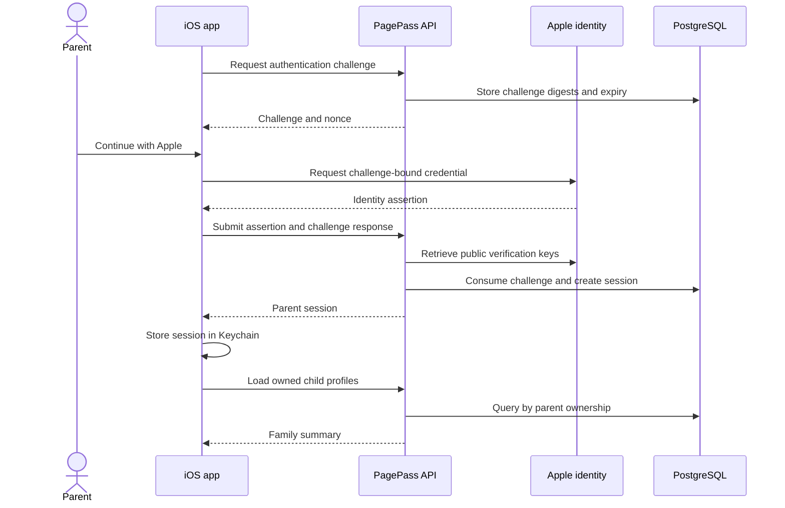
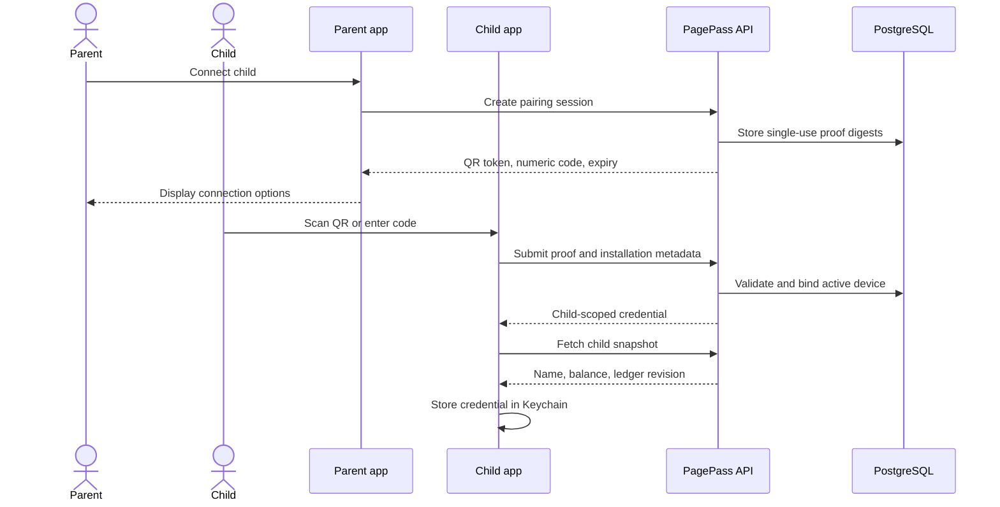
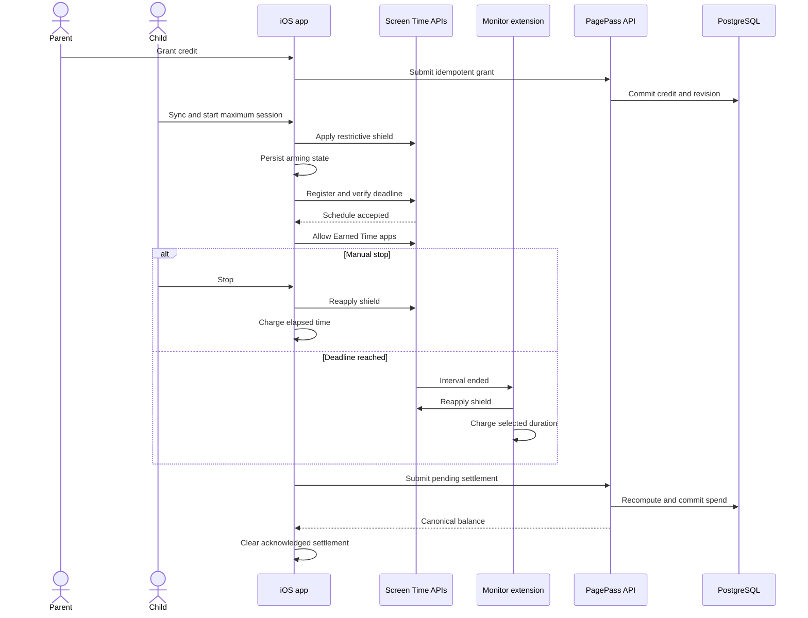

# PagePass Product Flows

The flows below describe behavior confirmed in the current MVP. The planned reading-report, OCR, and parent-approval workflow is intentionally omitted because its production path is not yet implemented in this repository.

## Flow 1: Parent Sign-In and Family Setup

### Goal

Give a parent authenticated access to the family area, where they can view and create child profiles.

### Actors

- Parent
- PagePass iOS app
- Apple identity service
- PagePass API
- PostgreSQL

### Preconditions

- The app is configured for Apple authentication.
- The API and database are available.
- The parent can complete the Apple authorization prompt.

### Main Steps

1. The app asks the API for a short-lived authentication challenge.
2. The parent completes Sign in with Apple using the challenge nonce and state.
3. The app submits the identity assertion and challenge response to the API.
4. The API verifies the assertion against Apple's public signing keys and consumes the challenge.
5. The API creates or finds the parent account, persists a revocable application session, and returns its token.
6. The app stores the session token and Apple user reference in the Keychain.
7. The app loads the authenticated parent's child profiles; the parent can add another profile.

### Failure or Alternate Paths

- If the parent cancels Apple authorization, the app remains signed out without treating the cancellation as a server failure.
- Invalid, expired, replayed, or mismatched challenges and identity assertions are rejected.
- Challenge creation is rate-limited by the API.
- If a restored session is expired, revoked, or no longer authorized by Apple, the app clears it and returns to sign-in.
- If server revocation is temporarily unavailable during sign-out, the token is moved to a pending-revocation Keychain record for retry.
- A controlled hybrid-auth path can claim data created under the earlier local-parent mode; this is migration behavior, not the normal user flow.

### Relevant Components

- Parent authentication store and gate view
- Parent Keychain credential store
- iOS API client
- Apple token verifier
- API authentication routes and PostgreSQL store

## Flow 2: Connect a Child Device

### Goal

Bind one iOS installation to a parent-owned child profile without sharing the parent's credential.

### Actors

- Parent
- Child
- Parent-role app
- Child-role app
- PagePass API
- PostgreSQL

### Preconditions

- The parent is authenticated and has created a child profile.
- The child installation has selected the child role.
- Both installations can reach the API.

### Main Steps

1. The parent requests a new connection for a child profile.
2. The API verifies ownership and creates one short-lived pairing session with QR and six-digit representations of the same connection opportunity.
3. The parent app displays the QR code and numeric fallback.
4. The child scans the QR code or enters the numeric code.
5. The child app submits exactly one proof together with a stable installation identifier and device name.
6. The API validates expiry, single use, ownership constraints, and active-device uniqueness.
7. The API records the active device and returns a child-scoped credential.
8. The child app verifies the credential by fetching a snapshot, then stores it in the Keychain.

### Failure or Alternate Paths

- A missing, malformed, expired, consumed, or unknown proof is rejected.
- Numeric attempts are rate-limited by both installation and request origin; QR and numeric proofs share the same single-use session.
- An installation already bound to another child cannot be reassigned through pairing.
- A child with a different active installation cannot be silently replaced.
- If the follow-up snapshot cannot be fetched, the app does not persist the new credential.
- QR scanning depends on device support; the six-digit path is the implemented fallback.

### Relevant Components

- Parent family view and pairing-session UI
- Core Image QR rendering
- VisionKit QR scanner
- Child pairing store and device Keychain store
- API pairing contract and PostgreSQL pairing/device tables

## Flow 3: Grant, Use, and Settle Earned Time

### Goal

Let a parent add canonical credit and let the child spend it in a deliberate, time-bounded session while selected apps remain restricted at every unsafe boundary.

### Actors

- Parent
- Child
- PagePass iOS app
- Device Activity monitor extension
- iOS Screen Time frameworks
- PagePass API
- PostgreSQL

### Preconditions

- The child device is paired and has synced its server snapshot.
- Screen Time child authorization is approved.
- At least one Earned Time app is selected and the local policy has been saved.
- The canonical balance is at least 15 minutes, the minimum enforced by the current implementation.
- No session is active or awaiting settlement.

### Main Steps

1. The parent grants credit. The client supplies an idempotency key, and the API commits one credit record and advances the ledger revision.
2. The child syncs the updated canonical balance.
3. The child taps **Use Earned Time**. The current interface requests the available balance as the session duration.
4. The app applies the no-session shield before creating any unlockable state.
5. The shared reducer persists an arming session with an absolute deadline.
6. The app registers a nonrepeating Device Activity schedule and verifies that the system retained it.
7. Only after registration succeeds does the reducer mark the session active and the app allow the selected Earned Time apps.
8. On manual stop, the host app re-applies the shield and charges rounded-up elapsed wall-clock seconds. On expiry, the monitor extension re-applies the shield and charges the selected duration.
9. The result becomes a durable pending settlement. The child app submits it when the API is reachable.
10. The API authenticates the paired device, validates the envelope, recomputes accepted consumption, serializes the balance update, and returns the canonical snapshot.
11. The child removes the acknowledged pending settlement and applies the returned balance when no unsafe local transition is in progress.

### Failure or Alternate Paths

- Schedule-registration or policy failures keep or restore the restrictive shield and do not create an active session.
- If the host app wakes after the deadline, it reconciles and closes the session even if the extension callback was delayed.
- Duplicate host and extension end attempts do not create duplicate local settlements.
- During an API outage, the local session still closes and the settlement remains queued; another session cannot begin while settlement is pending.
- Idempotent retries return the existing server result. Reusing the same key with different input is rejected.
- Concurrent spends are serialized; an overspend is rejected against the canonical balance.
- A changed server or child identity replaces local balance only after active and pending work is made safe.

### Relevant Components

- Parent family store
- Child session and pairing stores
- Earned Time reducer and model
- Shield controller and scheduler
- App Group state store and monitor extension
- Shared Zod settlement contract
- PostgreSQL credit and spend transactions

## Planned Flow: Reading Evidence and Parent Approval

The product requirements describe a future flow in which a child reads, submits a handwritten report image, receives OCR output, and waits for parent approval before credit is granted. Source code for image capture, upload, OCR, report records, review decisions, notifications, or AI assistance was not found in the current implementation. This flow should not be presented publicly as available until those boundaries exist and are verified.
