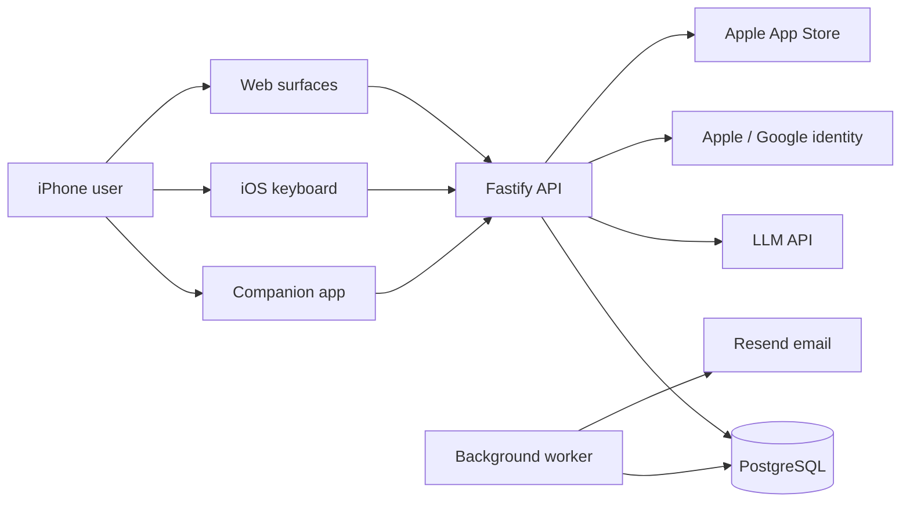
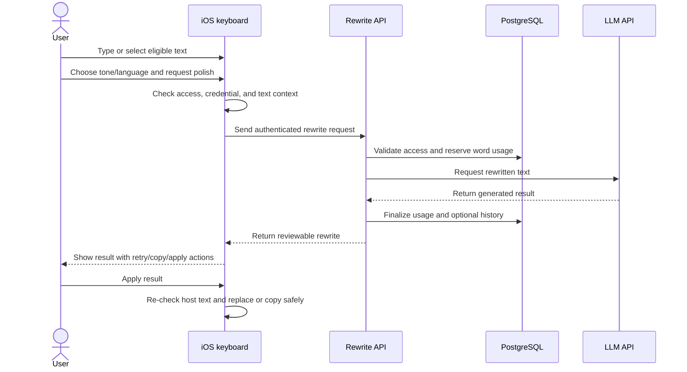

# Say Better

**Polish text from the keyboard, without leaving the app where you are writing.**

**Status:** Active development

**Application:** iPhone companion app and custom iOS keyboard, supported by web and API services

> This repository contains public product and architecture documentation only. The production source code is maintained in a private repository.

## Product Overview

Say Better is an iPhone writing assistant for people who want to refine messages, forms, and other text in place. Its custom keyboard captures eligible text, sends it for remote rewriting, and presents the result for review before anything is applied.

The companion app handles onboarding, authentication, keyboard setup, preferences, usage, rewrite activity, subscriptions, privacy controls, and support. This separation lets the keyboard stay focused on the short interaction that matters while giving account and data controls a full application surface.

## Core Capabilities

### In-context writing assistance

- Rewrite text from a custom iOS keyboard in supported host applications.
- Choose a tone and output language before generating a result.
- Review, retry, copy, cancel, or apply the proposed rewrite.
- Detect unsupported or unsafe contexts, including secure fields and cases where the host text changed before replacement.

### Companion experience

- Guided onboarding and keyboard-enablement instructions.
- Email/password authentication, password recovery, Sign in with Apple, and Google sign-in.
- Usage summaries, recent activity, history detail, and writing-habit summaries.
- User-controlled rewrite-history storage, history clearing, account deletion, legal links, and in-app support.

### Access and subscription management

- Free and paid plan state with weekly word accounting.
- Apple in-app purchase, restore, and server-side entitlement verification.
- A separate, revocable credential for keyboard requests rather than sharing the full app session directly.

### Operational support

- Idempotent rewrite requests and transactional word reservations around remote AI calls.
- Deferred cleanup for expired rewrite reservations and direct support-email delivery.
- Health, readiness, worker-status, and read-only administration surfaces.

## Engineering Scope

The repository represents end-to-end product engineering across:

- React Native product UI, navigation, account flows, local state, and iOS release tooling.
- Native Swift keyboard UI, text capture and replacement, App Group settings, and Keychain sharing.
- Fastify API design, shared runtime contracts, validation, authentication, and authorization.
- AI prompt/provider integration and structured rewrite handling.
- PostgreSQL data modeling, Prisma migrations, transactional usage accounting, and privacy-aware deletion.
- Apple in-app purchase verification and subscription lifecycle handling.
- Background workers, support-email delivery, Docker deployment, health checks, and a Next.js legal/admin surface.
- Automated tests across TypeScript, React Native, and native Swift components.

Authorship is not attributed to a specific individual here; the scope above reflects implemented areas visible in the private repository.

## Technology Stack

| Area | Technologies | How they are used |
| ---- | ------------ | ----------------- |
| iOS client | React Native, React, React Navigation, TypeScript | Companion app, onboarding, account management, dashboards, settings, subscriptions, and support |
| Keyboard extension | Swift, UIKit, SwiftUI, iOS text-document APIs | Custom keyboard, typed-text capture, rewrite review, and guarded apply/copy behavior |
| Local state | App Group `UserDefaults`, iOS Keychain | Shared preferences and protected keyboard credentials across the app/extension boundary |
| Backend | Node.js, Fastify, Zod | HTTP services, request validation, authorization, rewrite orchestration, billing, and support |
| AI | LLM API | Remote generation of tone- and language-aware rewrites through a server-side provider adapter |
| Database | PostgreSQL, Prisma | Accounts, sessions, settings, usage, request state, optional history, entitlements, support, and worker status |
| Authentication | Better Auth, JOSE, Apple and Google identity services | Email/password sessions, native identity verification, password recovery, and scoped keyboard access |
| Payments | `react-native-iap`, Apple App Store Server Library | Purchase/restore on iPhone and server-side signed transaction, status, and notification verification |
| Email | Resend | Password-reset and direct support-ticket email delivery |
| Web | Next.js, React | Public legal/support pages and a protected read-only administration interface |
| Tooling | pnpm workspaces, Nx, TypeScript | Monorepo dependency management, repeatable targets, and shared packages |
| Testing | Vitest, Jest, React Native Test Renderer, XCTest | API, contract, state, screen, integration, and native keyboard behavior checks |
| Deployment | Docker, EAS build configuration | Containerized API startup/migrations and iOS build/submission workflows |

## Architecture Overview

The iPhone app and keyboard share only the local settings and credentials needed across the extension boundary. Both call a Fastify API for authenticated product operations. The API owns policy enforcement, usage accounting, persistence, AI calls, subscription verification, and email handoff. A separate worker process recovers expired reservations and contains a support-outbox processor; the current support request path sends email directly rather than enqueueing that outbox.

## Primary Product Flow

The representative workflow is a keyboard rewrite with explicit user review:

## System Boundaries and Privacy

- **System input:** account details, identity assertions, keyboard text submitted for rewriting, tone/language choices, purchase evidence, settings, and user-created support content.
- **Remote processing:** submitted rewrite text travels through the API to the LLM API. Identity assertions are verified against Apple or Google. Purchase evidence and subscription state are verified with Apple. Password-reset and support content is sent through Resend.
- **Persistent server data:** PostgreSQL stores account/session records, settings, usage and request metadata, subscription entitlements, support records, and operational status. Input/output rewrite text is persisted as history only when the history setting permits it.
- **Local processing and storage:** text capture, host-context checks, review, and replacement occur in the keyboard extension. Shared preferences use an App Group container; protected app/keyboard credentials use Keychain storage.
- **Sensitive areas:** user-entered text, support attachments, credentials, identity tokens, purchase records, and optional rewrite history require careful handling. The implementation includes content-redacted logging helpers and account-deletion/anonymization behavior, but this documentation makes no regulatory-compliance claim.

## Engineering Challenges

### 1. Working within iOS keyboard-extension boundaries

**Constraint:** A third-party keyboard has a separate process, restricted host-app context, and needs user-enabled Full Access for network requests.

**Why it is difficult:** The companion app and extension must coordinate without assuming the extension can use the app's normal memory or session state.

**Approach:** Native Swift extension code shares preferences through an App Group, stores the keyboard credential in a shared Keychain access group, blocks unsupported fields, and guides the user back to the companion app when setup or authentication is incomplete.

### 2. Replacing text safely across unrelated host applications

**Constraint:** iOS exposes limited text-document context, and the text can change while an AI request is in flight.

**Why it is difficult:** Blind deletion and insertion could overwrite unrelated user edits or behave differently across host apps.

**Approach:** The keyboard keeps a typed-session buffer, captures surrounding context, requires review, re-checks the document before applying, and falls back to copying the result when replacement cannot be confirmed.

### 3. Keeping AI usage accounting consistent

**Constraint:** Remote generation can time out, fail, be retried, or receive duplicate client requests.

**Why it is difficult:** Charging before generation can strand quota; charging after generation can allow concurrent oversubscription.

**Approach:** The API validates an idempotency key and request fingerprint, reserves words transactionally, commits or releases the reservation with the terminal result, and sweeps abandoned reservations in a worker.

### 4. Separating app and extension authorization

**Constraint:** The keyboard needs API access but should not inherit every companion-app capability.

**Why it is difficult:** Both clients represent the same user while operating in different processes and risk profiles.

**Approach:** The app creates a short-lived, revocable keyboard credential with a narrow server-side endpoint allowlist. Only a hash is persisted on the server, while the secret remains in Keychain on the device.

### 5. Reconciling Apple subscription state

**Constraint:** Purchases, restores, renewals, revocations, and server notifications can arrive through different paths.

**Why it is difficult:** Client-reported state alone is not sufficient to grant durable access.

**Approach:** The client submits signed purchase evidence, while the API validates it with Apple's server library, binds it to the account, stores entitlement state, and processes signed lifecycle notifications.

## Repository Status

The private repository shows **active development** with implemented iPhone app, keyboard, API, database migrations, workers, web pages, tests, container configuration, and iOS build/submission tooling.

Public release availability, production traffic, production scale, external monitoring, and the deployed web-hosting model are not verifiable from repository evidence and are intentionally not claimed. No planned capability is presented as implemented in this showcase.

## Documentation

- [Technical architecture](docs/architecture.md)
- [Product flows](docs/product-flows.md)
- [Engineering decisions](docs/engineering-decisions.md)

## Product Screenshots

> Screenshots will be added after verifying that they contain no private user data, credentials, internal identifiers, or development-only information.

<!-- assets/onboarding-keyboard-setup.png — Guided keyboard setup in the companion app -->
<!-- assets/home-dashboard.png — Usage summary and recent rewrite activity -->
<!-- assets/keyboard-review.png — Rewrite result awaiting user review in the keyboard -->
<!-- assets/subscription.png — Plan purchase or restore screen -->

Capture and review guidance is available in [assets/README.md](assets/README.md).
