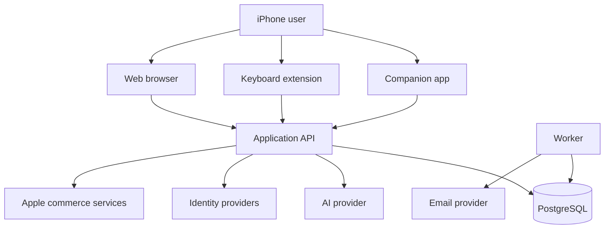
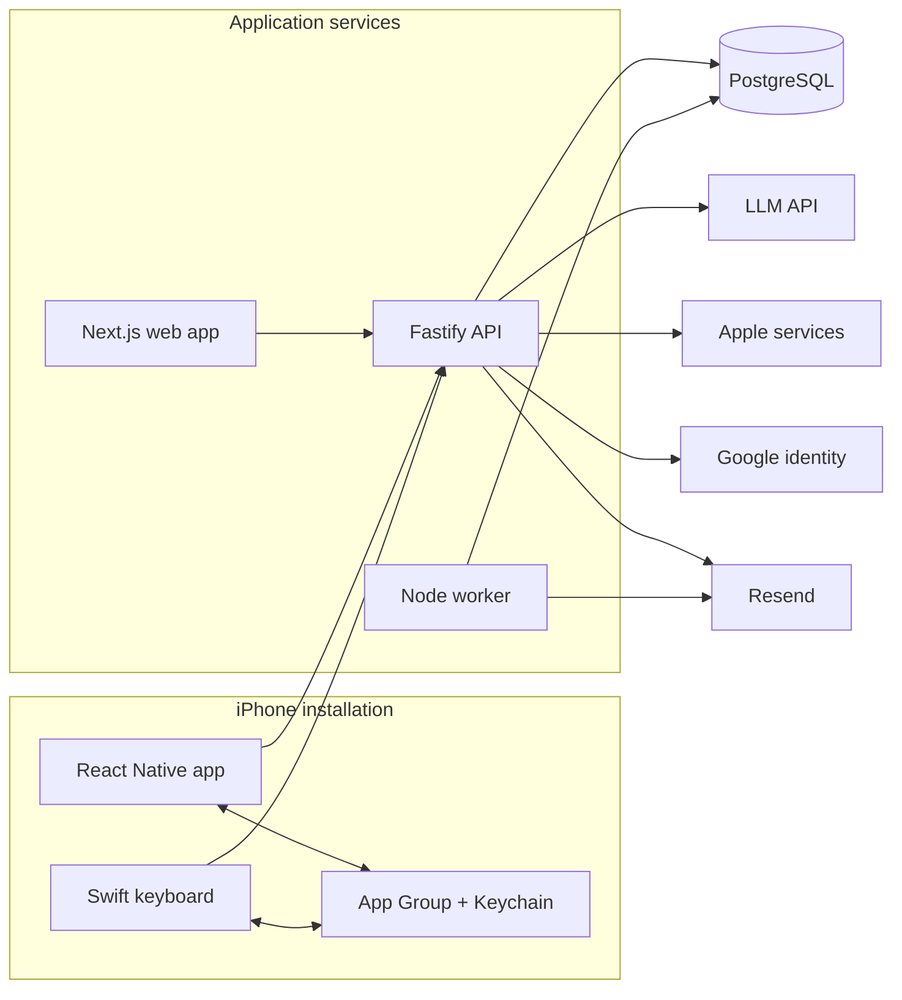
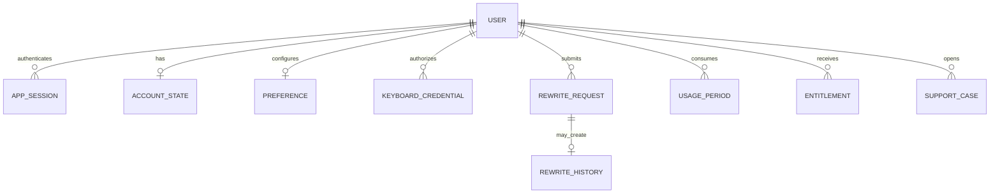
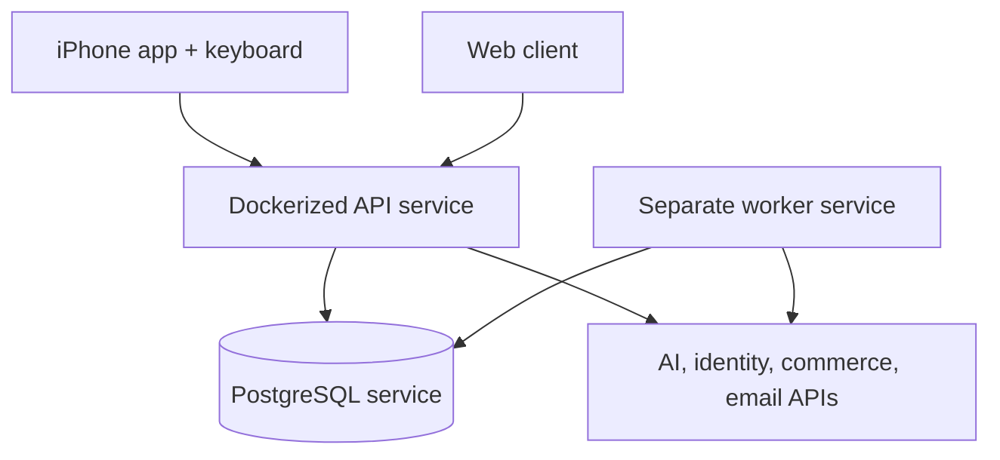

# Technical Architecture

## System Context

Say Better serves an iPhone user through two coordinated clients: a React Native companion app and a native iOS keyboard extension. The app owns setup, account, usage, subscription, privacy, and support workflows. The extension owns the short text-capture, rewrite-review, and apply interaction inside other applications.

A TypeScript API is the trust and orchestration boundary. It authenticates app and keyboard clients, enforces disclosure and plan rules, reserves usage, calls external services, and persists product state. A separate worker handles retryable or time-based work. Next.js provides legal/support pages and a protected read-only administration surface.

## Container-Level Architecture

The repository is a pnpm/Nx monorepo. Runtime code is divided by deployment and platform boundary, while workspace packages share contracts, configuration, AI abstractions, and privacy-safe helpers.

## Major Modules

| Module | Responsibility | Main dependencies |
| ------ | -------------- | ----------------- |
| Companion application | Onboarding, authentication, keyboard setup, dashboard, activity, settings, subscriptions, support, and account lifecycle | React Native, React Navigation, shared contracts, native bridges |
| Keyboard extension | Custom keyboard UI, text capture, context checks, rewrite submission, result review, and guarded apply/copy | Swift, UIKit/SwiftUI, iOS text-document APIs, shared native storage |
| API application | HTTP boundary, validation, authentication, authorization, rewrite orchestration, settings, billing, support, and admin reads | Fastify, Zod, Better Auth, Prisma |
| Rewrite and usage domain | Request fingerprinting, idempotency, quota reservation, AI result finalization, optional history, and failed-reservation recovery | PostgreSQL transactions, AI provider interface, shared contracts |
| Identity and access | Email/password sessions, Apple/Google identity verification, disclosure state, and scoped keyboard credentials | Better Auth, JOSE, Keychain, App Group metadata |
| Billing | Client purchase/restore and server-side transaction, entitlement, and notification handling | `react-native-iap`, Apple App Store Server Library, Prisma |
| Support and workers | Support intake, attachment validation, direct email delivery, reservation sweeps, an available outbox processor, and worker status | Fastify, Resend, Prisma, periodic Node process |
| Shared workspace packages | Cross-runtime schemas, product defaults, provider contracts, and privacy-safe logging fields | TypeScript, Zod, Vitest |
| Web surface | Public legal/support pages and protected, read-only operational overview | Next.js, React, API proxy routes |

## Data Architecture

PostgreSQL is the server system of record. The schema separates authentication records from product account state, user settings, usage counters/events, rewrite request state, optional text history, billing entitlements, support records, and worker health.

The diagram intentionally generalizes internal model and field names. Relationships are shown at the product level rather than as a public copy of the production schema.

Important data behaviors include:

- A rewrite request has an explicit lifecycle so duplicate and in-flight work can be distinguished.
- Usage is reserved before remote generation and finalized or released afterward.
- Text history is separate from operational rewrite metadata and follows the user's history preference.
- Account deletion removes authentication and direct user settings, deletes or redacts content where appropriate, and anonymizes retained operational records.
- Support cases are stored before direct email delivery is attempted, so a delivery error does not remove the database record.

On iPhone, the companion app and extension share non-secret preferences through an App Group container. Session and keyboard secrets use Keychain storage; the server stores a hash of the keyboard credential rather than its plaintext value.

## Authentication and Authorization

The companion app supports email/password authentication through Better Auth and native identity flows for Apple and Google. Native identity assertions are verified server-side against provider signing keys and expected audiences before an application session is created. Password recovery is also routed through the backend, with email delivery delegated to Resend.

Authenticated app sessions can access account, settings, history, billing, support, and keyboard-credential management. The keyboard receives a distinct, expiring and revocable credential after the required disclosure is accepted. API authorization differentiates app and keyboard modes and limits keyboard access to the small set of operations needed for rewriting and usage status.

Protected administration reads require an authenticated user that also matches a server-configured allowlist. The client is responsible for secure local storage and presenting disclosure/setup state; the server remains responsible for identity verification, authorization, plan state, quotas, and entitlement decisions.

## External Integrations

| Integration | Purpose | Data exchanged |
| ----------- | ------- | -------------- |
| LLM API | Generate rewritten text | Submitted text, requested mode/language, prompt instructions; a generated rewrite or structured failure returns |
| Apple identity | Native sign-in | Signed identity assertion and limited profile data needed to establish or link an account |
| Google identity | Native sign-in | OAuth authorization result/identity assertion and limited profile claims needed to establish or link an account |
| Apple App Store | Purchase, restore, subscription status, and lifecycle notifications | Signed transaction/renewal evidence, account-binding token, entitlement status, and notification payloads |
| Resend | Password recovery and support delivery | Destination email, reset link, or support message and user-selected attachments |

No analytics or push-notification provider is confirmed in the implementation inspected for this showcase.

## Deployment Model

The repository defines a Node 22 Docker image for the API. The image installs the API workspace and its internal packages, generates the Prisma client, runs database migrations before API startup, exposes a health check, and starts Fastify. Deployment notes describe a separate worker service using the worker command against the same PostgreSQL database. The worker executes reservation cleanup and polls a support outbox, then records timestamps exposed by readiness checks. No current support-intake enqueue path was found, so automatic support-email retry is not presented here as an active end-to-end capability.

The iOS project includes iPhone-only Xcode configuration plus EAS/local build and App Store submission commands. The Next.js application has standard build/start targets, but the repository does not identify its production hosting provider. PostgreSQL provisioning, traffic routing, secret storage, backups, and external monitoring are also outside the verifiable repository configuration.

The diagram shows repository-confirmed runtime roles, not a claim about a specific production cloud topology.
