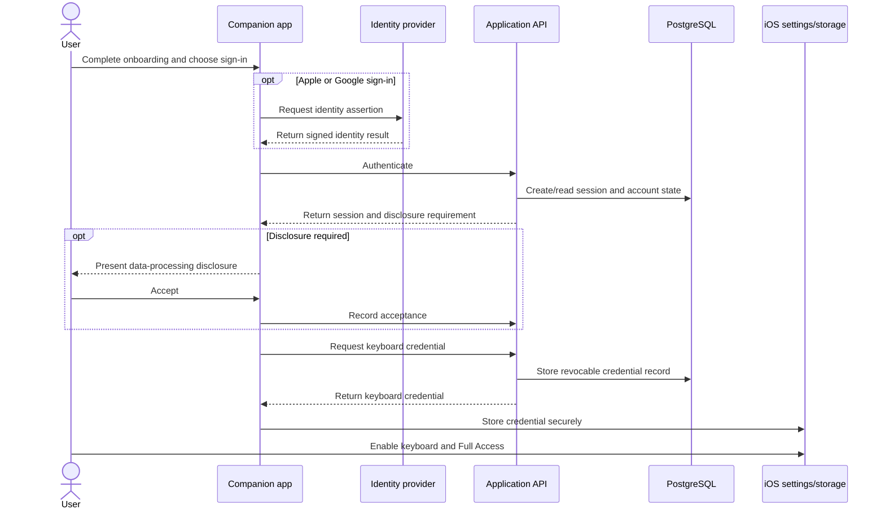
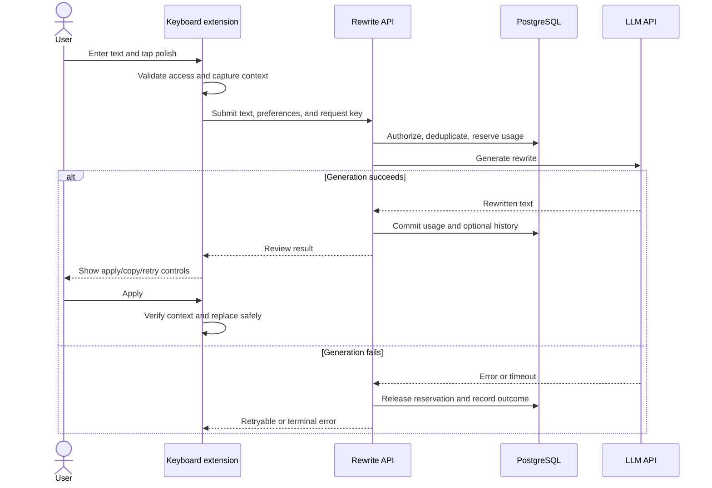
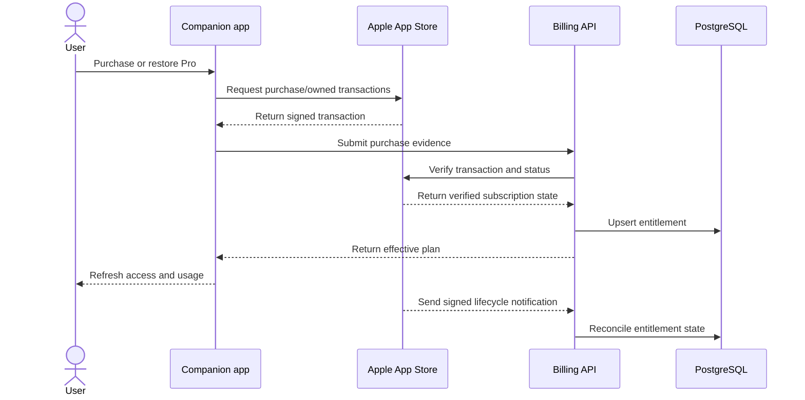
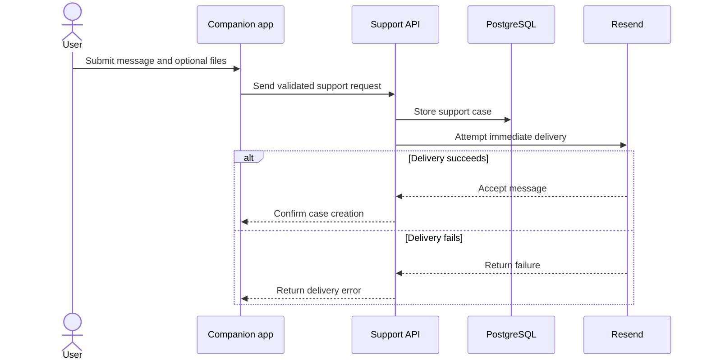

# Product Flows

## Flow 1: Establish App and Keyboard Access

**Goal:** Prepare an authenticated user to request rewrites from the custom keyboard.

**Actors:** User, companion app, Apple/Google identity service when selected, API, PostgreSQL, iOS settings and secure storage.

**Preconditions:** The iPhone app is installed. Network access is available for authentication. The keyboard has not necessarily been enabled yet.

**Main steps:**

1. The app presents onboarding and keyboard-setup guidance.
2. The user authenticates with email/password, Apple, or Google.
3. The API verifies the credential, establishes a server session, and reads account/disclosure state.
4. If needed, the app presents the rewrite-data disclosure and records acceptance through the API.
5. The app requests a restricted keyboard credential and stores it in shared Keychain access.
6. The user enables the keyboard and Full Access in iOS Settings.
7. The app re-checks keyboard state when returning to the foreground.

**Failure or alternate paths:** Invalid identity evidence is rejected; email users can request password reset; identity-link conflicts require a different sign-in path; disclosure must be accepted before keyboard access is issued; missing Full Access keeps network rewriting disabled; expired or revoked keyboard access directs the user back to the app.

**Relevant components:** React Native auth/onboarding screens, native authentication bridge, Better Auth, native JWT verification, disclosure routes, keyboard-token service, App Group/Keychain bridge.

## Flow 2: Polish and Apply Text from the Keyboard

**Goal:** Generate a rewrite and let the user decide whether it should replace the current text.

**Actors:** User, keyboard extension, API, PostgreSQL, LLM API.

**Preconditions:** The keyboard is enabled, Full Access is available, a valid keyboard credential exists, required disclosure is current, and the active input is eligible for capture.

**Main steps:**

1. The extension tracks text typed through its keyboard or inspects an eligible focused input.
2. The user selects a tone/output language and requests a rewrite.
3. The extension blocks secure, unsupported, empty, or over-limit input before sending.
4. The API validates the credential and contract, checks disclosure/plan state, deduplicates the request, and reserves word usage.
5. The API sends the text and rewrite instructions to the LLM API.
6. The API finalizes request/usage state and stores history only when the history preference allows it.
7. The extension shows the proposed result for review.
8. On apply, the extension verifies that the host text still matches the captured context, then replaces it. If safe replacement is unavailable, the user can copy the result.

**Failure or alternate paths:** The extension requests app sign-in when authorization is missing; Full Access or network failure stops generation; quota exhaustion returns current usage state; duplicate completed requests do not repeat generation; provider failure releases reserved usage; the user can retry, copy, or cancel; changed host text prevents unsafe replacement.

**Relevant components:** Swift keyboard UI/controller, typed-session buffer, capture/replacement adapters, rewrite API route, shared Zod contracts, usage reservation/fingerprint services, AI provider adapter, history settings.

## Flow 3: Purchase or Restore Pro Access

**Goal:** Reconcile an Apple purchase with server-owned plan access.

**Actors:** User, companion app, Apple App Store, API, PostgreSQL.

**Preconditions:** The user is authenticated, Apple in-app purchases are available, and the subscription product is configured for the build and API environment.

**Main steps:**

1. The app loads the subscription screen and starts a purchase or restore through Apple's in-app purchase APIs.
2. Apple returns signed purchase evidence for an owned subscription.
3. The app sends that signed evidence to the API.
4. The API verifies the transaction and current subscription status with Apple and reconciles its account binding.
5. The API stores the entitlement and returns the effective plan.
6. The app finishes the purchase acknowledgement and refreshes account/usage state.
7. Later Apple server notifications update renewal, expiration, grace, or revocation state.

**Failure or alternate paths:** Cancellation is non-fatal; missing or invalid signed evidence is rejected; an account-binding mismatch does not grant access; a previous purchase can be restored; server verification failure leaves the existing entitlement unchanged; the app can direct restore failures to support.

**Relevant components:** Subscription and restore screens, `react-native-iap` client, billing API routes, Apple App Store Server Library adapter, entitlement model, Apple notification handler.

## Flow 4: Submit a Support Request

**Goal:** Store an in-app support request and deliver it to the support channel.

**Actors:** User, companion app, API, PostgreSQL, Resend, support recipient.

**Preconditions:** The user is authenticated and the submitted category, message, and optional attachments pass client and server validation.

**Main steps:**

1. The user writes a support request and optionally selects attachments in the companion app.
2. The API validates the payload and stores the support case in PostgreSQL.
3. The API attempts immediate email delivery through Resend.
4. On success, the app receives the support case reference.

**Failure or alternate paths:** Invalid or oversized attachment data is rejected; missing email configuration or delivery failure returns an error, while the already-created database case remains. The repository also contains a locking/backoff outbox worker, but no current support-intake code path was found that creates its queue records, so automatic retry is not represented as part of this implemented flow.

**Relevant components:** Support screen/native attachment picker, support API route, support-case data, and Resend email adapter.

